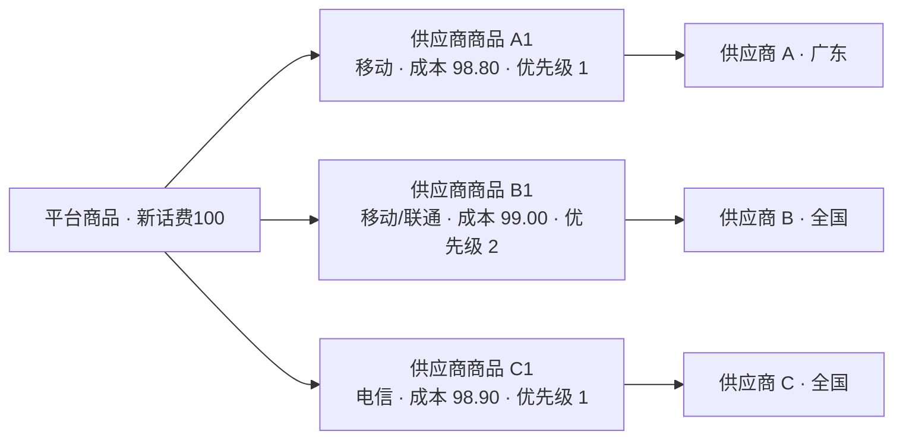
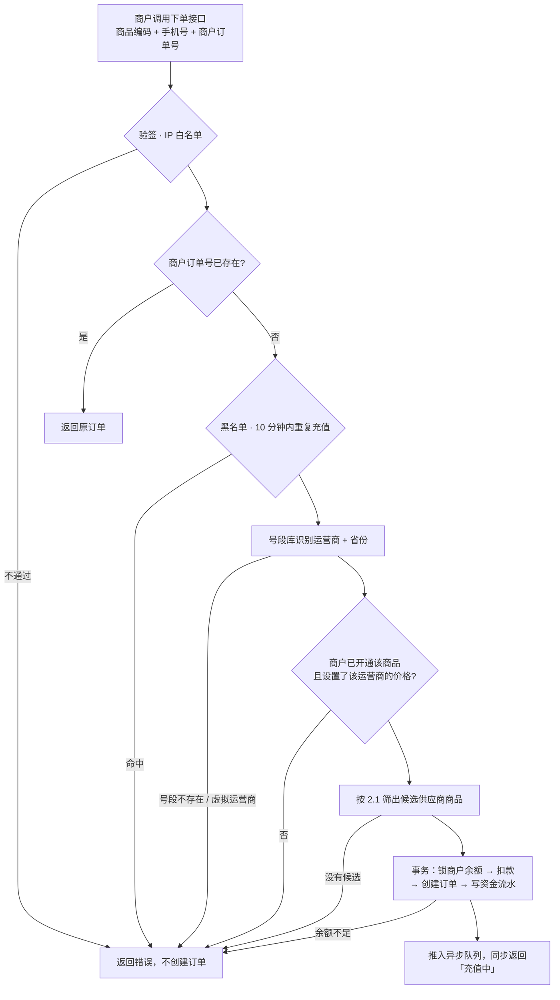
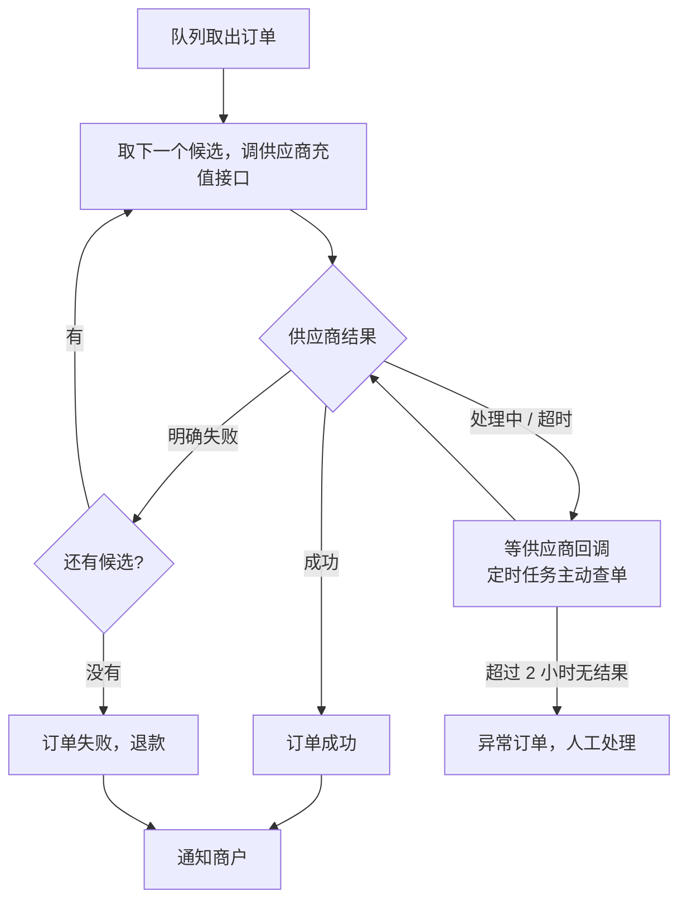
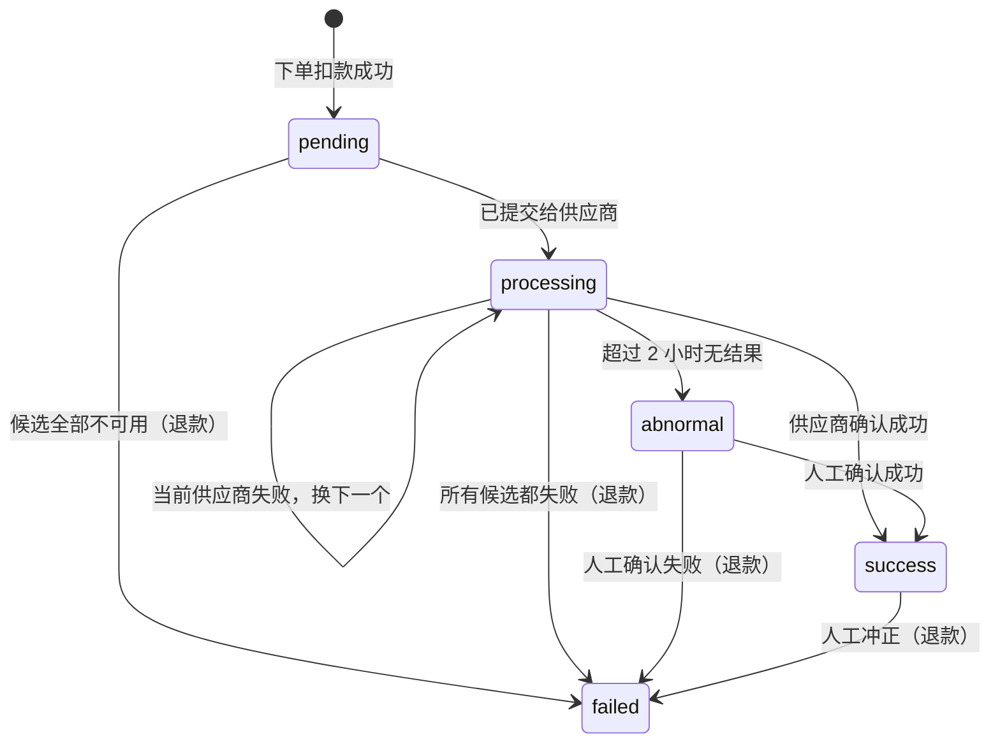
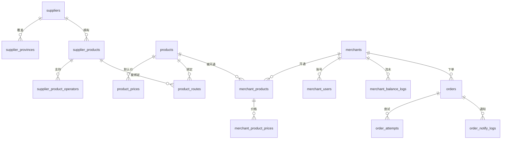

# phoneBill 话费充值平台 · 项目文档

> 最后更新：2026-10-06。需求已基本确定，未定事项见第 10 章。

## 1. 项目概述

phoneBill 是一个话费充值平台。平台自己不直接充话费，而是接入多家**供应商**的充值接口：

1. **商户**通过 API 提交充值订单，平台从商户的**预存余额**里扣款；
2. 平台按手机号识别**运营商**和**省份**，从商品绑定的供应商商品里挑出合适的去充值；
3. 拿到结果后通知商户；失败的订单退款。

### 1.1 范围

| 本期做 | 本期不做 |
|---|---|
| 话费快充 | 慢充、流量包等其他品类 |
| 移动、联通、电信、广电号码 | 虚拟运营商号码（170/171/162/165/167 等） |
| 中国大陆 11 位手机号 | 携号转网的准确识别（接受误差，见 5.1） |
| 商户 API 下单、预存余额扣款 | C 端用户下单、在线支付、商户在线充值 |
| 平台管理后台、商户后台（只读） | 商户在后台手动下单 |

### 1.2 角色与端

| 角色 | 使用的端 | 能做什么 |
|---|---|---|
| 平台管理员 | 平台管理后台（`web/`，已有基础） | 管理供应商、商品、商户、订单、风控 |
| 商户 | 商户后台（新增，独立前端项目 `merchant-web/`） | 只读：订单记录、资金流水、订单状态 |
| 商户的系统 | 开放接口 `/open/v1`（新增，接入文档 [api.md](api.md)） | 下单、查单、查余额、查商品，接收结果通知 |
| 供应商 | 供应商的接口 | 平台调它充值、查单；它回调平台告知结果 |

### 1.3 技术基础

Hyperf 3.1 + PHP 8.4 + Swoole，Vue 3 + TypeScript + Element Plus。已有：管理员登录（JWT）、RBAC 权限、操作日志、定时任务进程、异步队列进程。新业务按 `Controller → Service → Dao → Model` 分层添加，编码规范见 `.claude/skills/hyperf-conventions/SKILL.md`。

## 2. 业务规则

本章把所有已确定的规则集中在一起，后面各章按这些规则展开。

### 2.1 商品与选路

- **平台商品**按面值建，一个商品覆盖多个运营商，例如「新话费100」。
- 平台商品绑定多个**供应商商品**（面值必须相同），每个绑定有优先级。
- 供应商商品可以支持多个运营商；**供应商**设置覆盖的省份（可选「全国」）。
- 下单时，候选供应商商品必须同时满足：
    1. 支持该号码的运营商；
    2. 所属供应商覆盖该号码的省份；
    3. 供应商、供应商商品都是启用状态；
    4. 对应的通道没有在维护中。
- 候选按**优先级**排序，优先级相同时**成本低的在前**；依次尝试，直到成功。
- 一个候选都没有时，**直接拒绝下单，不扣款**。例如商品只绑定了只做广东的供应商 A，非广东号码下单就被拒绝。



上图中：广东移动号码 → 候选 A1、B1，先走 A1；湖南移动 → 只有 B1；湖南电信 → 只有 C1；任何地区的联通 → 只有 B1。

### 2.2 价格

- 价格由「**商户 + 商品 + 运营商**」三者确定。例如商户甲买「新话费100」：移动 99.50、电信 99.80。
- 商户必须先**开通**商品才能下单；开通的商品里，没有设置某个运营商的价格，该运营商的号码就不能下单。
- 平台商品上按运营商设置**默认售价**，只用来在开通时带出初始价格，开通后可以改。
- 价格低于成本价时后台提示，不拦截。
- 改价只影响之后的订单；订单记录下单时的价格。

### 2.3 号码

- 只支持中国大陆 11 位手机号。
- 运营商和省份按号段库（前 7 位）识别；号段不存在或属于虚拟运营商时拒绝下单。

### 2.4 资金

- 商户预存余额。商户线下打款，管理员在后台手动加款（也可以手动扣款），必须填备注。
- 下单成功即扣款；订单最终失败时退回。每一笔余额变动都写资金流水。
- 冲正（成功订单事后被供应商撤销）：管理员手动改为失败并退款，需单独权限，必须填原因。

### 2.5 订单与风控

- 商户订单号在商户内唯一；重复提交时返回原订单，不重复扣款。失败订单要重下必须换新单号。
- 同一手机号、同一面值，**10 分钟**内只允许一笔进行中的订单。
- 号码在黑名单里时拒绝下单。
- 调供应商超时或返回「处理中」时**不能当失败**，以回调或查单结果为准。
- 下单后 **2 小时**仍无结果的订单转为异常订单，人工处理，**不自动退款**。

### 2.6 可配置参数

| 参数 | 默认值 |
|---|---|
| 重复充值拦截时间窗口 | 10 分钟 |
| 订单超时转人工 | 2 小时 |
| 提交后开始主动查单 | 5 分钟后，之后每 5 分钟一次 |
| 通知商户的重试间隔 | 1、5、15、30、60 分钟，最多 5 次 |
| 开放接口签名有效期 | 5 分钟 |

## 3. 业务流程

### 3.1 下单



### 3.2 充值与结果处理



并发控制：扣款和退款在事务里 `lockForUpdate()` 锁商户行，锁内重新读余额再判断；订单状态更新带条件 `where status = 预期状态`，影响行数为 1 才算成功，保证回调、查单、人工操作同时到达时只生效一次。

### 3.3 订单状态



| 状态 | 含义 | 商户看到的 |
|---|---|---|
| `pending` | 已扣款，还没提交给供应商 | 充值中 |
| `processing` | 已提交，等待结果 | 充值中 |
| `abnormal` | 超时无结果，等人工处理 | 充值中 |
| `success` | 充值成功 | 成功 |
| `failed` | 充值失败，余额已退回 | 失败 |

## 4. 平台管理后台

### 4.1 菜单

| 菜单组 | 页面 | 阶段 |
|---|---|---|
| 商品中心 | 供应商、供应商商品、平台商品 | 一 |
| 风控 | 号段查询、号码黑名单、通道维护 | 一（号段查询） / 二 |
| 商户中心 | 商户、商户商品与价格、资金流水 | 二 |
| 订单中心 | 订单列表、异常订单 | 二 |
| 系统管理 | 管理员、角色权限、操作日志（已有） | — |

### 4.2 供应商

- 字段：名称、编码、对接驱动、接口参数、覆盖省份（多选，可选「全国」）、状态、备注。
- 接口参数按所选驱动动态渲染（不同供应商要填的不一样）；密钥加密存库，列表和日志里打码。
- 操作：新增、编辑、启用/停用、测试连通性、查询供应商余额（驱动支持时）。
- 停用后不再参与选路，历史订单照常可查。

### 4.3 供应商商品

- 字段：所属供应商、名称、支持的运营商（多选：移动 / 联通 / 电信 / 广电）、面值、成本价、供应商侧商品编码、状态（上架/下架）。
- 列表可按供应商、运营商、面值、状态筛选。

### 4.4 平台商品

- 字段：商品编码（商户下单用）、名称、面值、状态。
- 默认售价：按运营商分别填写。
- 绑定供应商商品：只能选面值相同的，可以多选（跨运营商、跨供应商），每个设优先级（数字越小越先用）。
- 编辑页自动汇总「覆盖运营商」（由绑定的供应商商品得出），方便发现漏配的运营商。
- 某个运营商的默认售价低于该运营商下绑定的成本价时提示。

### 4.5 风控

- **号段查询**：输入手机号，显示运营商、省份、城市、是否虚拟运营商，以及每个商品下会命中哪些候选供应商商品（排查选路用）。
- **号码黑名单**：新增、删除，带原因。
- **通道维护**：按「供应商」或「供应商 + 运营商 + 省份」临时关闭，设开始和结束时间，到时自动恢复。

### 4.6 商户中心

- **商户**：名称、联系人、电话、状态、AppKey / AppSecret（可重置）、回调地址、IP 白名单；管理商户后台登录账号（可多个，创建、重置密码、启停）。
- **商户商品与价格**：为商户开通商品，按运营商设置价格（开通时带出默认售价）。
- **余额调整**：加款/扣款，必须填备注，记录操作人。
- **资金流水**：所有商户的余额变动，可按商户、类型、时间筛选。

### 4.7 订单中心

- **订单列表**：按商户、平台/商户订单号、手机号、商品、运营商、省份、状态、供应商、时间筛选；支持导出。
- **订单详情**：基本信息、扣款与成本、每一次供应商尝试的请求和响应、通知商户的记录。
- **人工操作**（记操作日志）：手动查单、处理异常订单（置成功/失败）、冲正、重发商户通知。
- **异常订单**：单独列出 `abnormal` 状态的订单，方便处理。

## 5. 商户后台与开放接口

### 5.1 商户后台（只读）

| 页面 | 内容 |
|---|---|
| 首页 | 当前余额；今日订单数、成功数、成功金额 |
| 订单记录 | 平台订单号、商户订单号、手机号、商品、运营商、扣款金额、状态、下单/完成时间；可筛选、看详情 |
| 资金流水 | 类型（加款 / 下单扣款 / 失败退款 / 人工调整）、金额、变动后余额、关联订单号、时间 |
| 账户 | 修改密码；查看 AppKey、回调地址、已开通的商品和价格、接入文档 |

- 登录体系与平台后台完全分开：独立账号表、独立 JWT 密钥 `MERCHANT_JWT_SECRET`、路由前缀 `/merchant`。
- 所有查询在 Service 层强制按当前登录商户过滤，不信任前端传来的商户 ID。
- 前端是独立项目 `merchant-web/`（技术栈同 `web/`），和管理端分开构建、分开部署：管理端可以只放内网，商户端放外网，部署在 `/merchant/` 路径或单独的子域名。后端是同一个服务。

### 5.2 开放接口

给商户的接入文档（签名、错误码、通知格式）见 [api.md](api.md)。

| 接口 | 说明 |
|---|---|
| `POST /open/v1/recharge` | 下单：`product_code`、`mobile`、`merchant_order_no`、`notify_url`（可选，不传用商户配置的） |
| `GET /open/v1/order` | 按平台订单号或商户订单号查单 |
| `GET /open/v1/balance` | 查余额 |
| `GET /open/v1/products` | 查已开通的商品及各运营商价格 |

- 签名：参数按 key 排序拼接，用 `app_secret` 做 HMAC-SHA256；带 `timestamp`（5 分钟内有效）和 `nonce`（Redis 去重防重放）；校验 IP 白名单。
- 结果通知：订单到达终态（成功/失败）后 POST JSON 到通知地址，带签名；商户返回 HTTP 200 且响应体为 `success` 才算送达，否则按 2.6 的间隔重试。
- 供应商回调地址：`/notify/supplier/{供应商编码}`。

## 6. 数据模型

金额列统一 `decimal(12,2)`，代码里用 bcmath 计算。每张表都有 `id`、`created_at`、`updated_at`，下表只列主要字段。运营商编码：`cmcc` 移动、`cucc` 联通、`ctcc` 电信、`cbn` 广电。



| 表 | 说明 | 主要字段 |
|---|---|---|
| **商品与供应商** | | |
| `suppliers` | 供应商 | `name`、`code`（唯一）、`driver`、`config`（JSON，加密）、`status`、`remark` |
| `supplier_provinces` | 供应商覆盖的省份 | `supplier_id`、`province`（`*` 表示全国） |
| `supplier_products` | 供应商商品 | `supplier_id`、`name`、`face_value`、`cost_price`、`external_code`、`status` |
| `supplier_product_operators` | 供应商商品支持的运营商 | `supplier_product_id`、`operator` |
| `products` | 平台商品 | `code`（唯一）、`name`、`face_value`、`status` |
| `product_prices` | 平台商品各运营商默认售价 | `product_id`、`operator`、`default_price`；唯一 `(product_id, operator)` |
| `product_routes` | 平台商品绑定的供应商商品 | `product_id`、`supplier_product_id`、`priority`；唯一 `(product_id, supplier_product_id)` |
| **号码与风控** | | |
| `mobile_segments` | 号段库 | `segment`（7 位，唯一）、`operator`、`province`、`city`、`is_virtual` |
| `mobile_blacklist` | 号码黑名单 | `mobile`（唯一）、`reason` |
| `channel_maintenances` | 通道维护 | `supplier_id`、`operator`（可空）、`province`（可空）、`start_at`、`end_at`、`reason` |
| **商户** | | |
| `merchants` | 商户 | `name`、`contact`、`phone`、`app_key`（唯一）、`app_secret`（加密）、`balance`、`notify_url`、`ip_whitelist`、`status` |
| `merchant_users` | 商户后台账号 | `merchant_id`、`username`（唯一）、`password`、`status`、`last_login_at` |
| `merchant_products` | 商户开通的商品 | `merchant_id`、`product_id`、`status`；唯一 `(merchant_id, product_id)` |
| `merchant_product_prices` | 商户各运营商价格 | `merchant_product_id`、`operator`、`price`；唯一 `(merchant_product_id, operator)` |
| `merchant_balance_logs` | 资金流水 | `merchant_id`、`type`、`amount`（有正负）、`balance_after`、`order_id`、`remark`、`admin_id` |
| **订单** | | |
| `orders` | 订单 | `order_no`（唯一）、`merchant_id`、`merchant_order_no`、`product_id`、`product_name`、`mobile`、`operator`、`province`、`face_value`、`sale_price`、`cost_price`、`supplier_id`、`supplier_product_id`、`status`、`fail_reason`、`notify_url`、`notify_status`、`finished_at`；唯一 `(merchant_id, merchant_order_no)` |
| `order_attempts` | 每次提交给供应商的记录 | `order_id`、`supplier_id`、`supplier_product_id`、`supplier_order_no`、`cost_price`、`status`、`request`、`response`、`submitted_at`、`finished_at` |
| `order_notify_logs` | 通知商户的记录 | `order_id`、`attempt_no`、`http_status`、`response`、`next_retry_at` |

说明：`orders.sale_price` 是下单时该商户该运营商的价格快照；`cost_price` 和 `supplier_id` 记录最终成功的那一次尝试，用于利润统计。

## 7. 供应商对接

供应商尚未确定，先定好统一接口，每接一家只加一个驱动类，业务代码不用改。

```
app/Supplier/
├── SupplierDriverInterface.php   # 所有驱动实现这个接口
├── SupplierDriverRegistry.php    # 按 suppliers.driver 找到驱动
├── Result/                       # 统一返回结构：成功 / 失败 / 处理中
└── Driver/
    ├── MockDriver.php            # 开发测试用，可配置返回成功/失败/处理中/超时
    └── XxxDriver.php             # 每家供应商一个
```

| 方法 | 作用 |
|---|---|
| `recharge(order, supplierProduct, config)` | 提交充值，返回结果 + 供应商订单号 |
| `query(attempt, config)` | 主动查单 |
| `parseCallback(request, config)` | 验签并解析供应商回调 |
| `balance(config)` | 查我们在该供应商的余额（可选） |
| `configSchema()` | 声明需要填哪些参数，后台据此渲染表单 |

- 供应商回调地址：`/notify/supplier/{supplier_code}`。
- 请求和响应完整记到 `order_attempts`，同时写日志渠道 `supplier`。
- 接入新供应商：写驱动类 → 注册驱动编码 → 后台新增供应商时选驱动、填参数。

## 8. 权限

平台后台沿用现有 RBAC，新增权限编码同步加进 `AdminBootstrapService::KNOWN_PERMISSIONS`。

| 模块 | 查看 | 管理 |
|---|---|---|
| 供应商 | `supplier.view` | `supplier.manage` |
| 供应商商品 | `supplier_product.view` | `supplier_product.manage` |
| 平台商品 | `product.view` | `product.manage` |
| 风控（号段查询、黑名单、通道维护） | `risk.view` | `risk.manage` |
| 商户 | `merchant.view` | `merchant.manage` |
| 商户商品与价格 | `merchant.view` | `merchant.price` |
| 商户余额调整 | — | `merchant.balance` |
| 订单 | `order.view` | `order.manage`（查单、处理异常、重发通知） |
| 冲正 | — | `order.reverse` |

## 9. 开发计划

| 阶段 | 内容 | 完成标准 |
|---|---|---|
| 一 · 商品基础 | 供应商、供应商商品、平台商品（含默认售价、绑定）；号段表 + 识别服务 + 号段查询页 | 后台能配好「平台商品 → 供应商商品 → 供应商」；输入手机号能看到识别结果和命中的候选 |
| 二 · 下单主流程 | 商户、商户商品与价格、余额与流水；开放接口；订单、扣款、退款；供应商对接层 + `MockDriver`；回调、主动查单、通知商户；黑名单、通道维护、重复拦截、异常订单 | 用 Mock 供应商跑通：成功、失败换供应商、全部失败退款、超时转异常、重复拦截；余额和流水对得上 |
| 三 · 商户后台 | 登录、首页、订单记录、资金流水、账户 | 商户只能看到自己的数据 |
| 四 · 真实供应商 | 按选定的供应商写驱动并联调；号段库正式导入 | 真实号码小额充值成功 |
| 五 · 运营完善 | 对账、利润报表、告警（异常订单、供应商余额不足）、连续失败自动熔断、按成功率选路 | 按需再定 |

供应商没定不影响前三个阶段，用 `MockDriver` 就能把流程开发完、测完。

**进度：** 第一阶段已完成（2026-10-06）。供应商的「测试连通性」「查询余额」要等驱动有对接能力后在第四阶段加上；号段导入命令等样例文件到了再写。

## 10. 未定事项

| 事项 | 影响 | 状态 |
|---|---|---|
| 号段库样例文件（格式和字段） | 导入命令；开发期先用手工测试数据 | 暂缓，等你提供 |
| 预计订单量（每天大概多少单） | 队列并发数、是否按供应商限流 | 不影响开工 |
| 计划上线时间 | 各阶段排期 | 不影响开工 |
| 告警通知渠道（企业微信/钉钉/短信） | 第五阶段 | 届时再定 |
